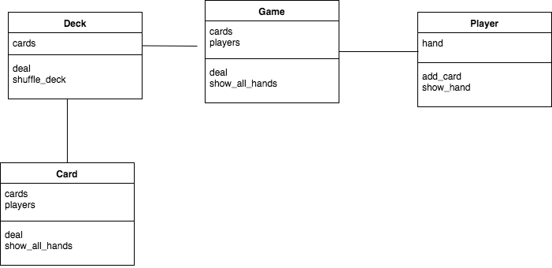
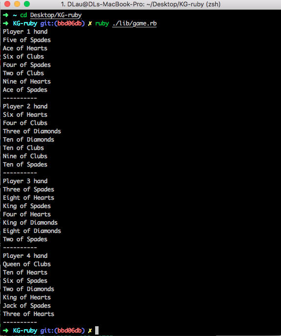

# Deck of Cards App - Daniel Lau

## Overview

A simple command line application that, when executed creates a deck of 52 cards, shuffles them and deals 7 cards to 4 players.

---------------
### Provided Requirements

The scenario is as follows:
You have a deck of 52 cards, comprised of 4 suits (hearts, clubs, spades and diamonds) each with 13 values (Ace, two, three, four, five, six, seven, eight, nine, ten, jack, queen and king).
There are four players waiting to play around a table.
The deck arrives in perfect sequence (so, ace of hearts is at the bottom, two of hearts is next, etc. all the way up to king of diamonds on the top).

The task is a simple one. Please create a simple command line program that when executed recreates the scenario above and then performs the following two actions:
Shuffle the cards  - We would like to take the deck that is in sequence and shuffle it so that no two cards are still in sequence.
Deal the cards - We would then like to deal seven cards to each player (one card to the each player, then a second card to each player, and so on)

-----------------

## Installation and Launching App

Open terminal and navigate to directory
```
cd deck-of-cards
```
Install dependencies
```
bundle install
```
run application
```
ruby ruby ./lib/game.rb
```
run `rspec` to check tests and coverage

## Technology
Ruby, RSpec, Simple Coverage, Rubocop

Given the timeframe for this task I decided to fully TDD it with a more familiar and 'stronger' language. I have also attempted this task learning a new language and using PHP, however due to time constraints and other commitments I had to spike the code- no tests were written.

## Approach

#### 1. Analysing requirements
I firstly broke down the criteria into smaller tasks:
  - generate a single card
  - generate a deck of cards
  - randomly shuffle the deck
  - add check to see if cards are properly shuffled i.e. no two cards are in sequence
  - generate 4 player
  - deal 7 cards to each player


#### 2. Diagramming
The next step I made a few attempts to diagramming my approach to this task, thinking about the classes and it's purpose.

Initially I started with 3 classes Card, Deck and Game. The game class would hold 4 player arrays and store all the cards in their hand. However, following the single responsibility principles I decided to add a player class as this would be necessary if I was to expand on this game. It would allow us to create player behaviours such as putting card to table.

Eventually the below was the approach I took:




#### 3. Class Responsibilities

The application is split into 4 classes:

Card- This stores details of a particular card i.e. the suit and value and dsiplays them
Deck - This class generates a new deck of cards when initiated. It handles the shuffle logic which shuffles the deck of cards and checks to see if any cards are in consecutive order. It also handles the deal logic which takes the last card out of the deck.
Player - The player class stores the player's cards in their hand and allows the player to get a card from the deck. It also displays the players hand in the deterministically
Game - The game class is the beginning of the card game. It will shuffle the deck, create 4 player instances and deals cards 7 cards by default to each player. It also has a method that can display all of the players hand.  


#### 4. Process
I stuck to the red-green-refactor TDD process to complete the task as much as I could. I ended up writing the feature tests whilst I was implementing the game class.

#### 6. Assumptions
- There are always 4 players around the table when a game is initiated
- Upon executing `game.rb` a new deck of card is available and dealt immediately rather than a user having to interact with the program and manually insert commands.
- The last card is not consecutive to the first card i.e. does not loop around


## Further Improvements
- The program currently uses Ruby's built-in shuffle method to shuffle the deck of cards, it could be possible to use another algorithm such as the Fisher-Yates method to shuffle the cards.
- Exploration into using Forwardable module to delegate methods such as deal and shuffle to another class
- Add check to cover edge case for checking if king of diamonds is next to Ace of Hearts


## Example

